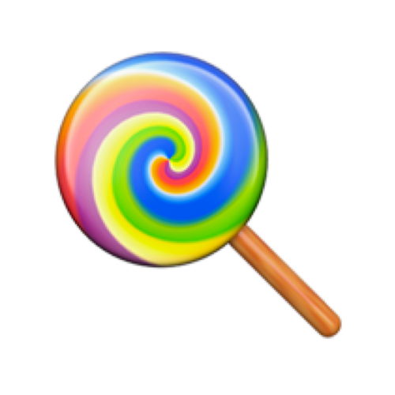

<p align="center">
  
  <h1 align="center">React Native Gesture Detector</h1>
  <h3 align="center">Create and detect custom gestures on React Native.</h3>
</p>

[](https://npmjs.org/package/react-native-gesture-detector)
[](https://github.com/mxmzb/react-native-gesture-detector/blob/master/LICENSE)
[](https://npmjs.org/package/react-native-gesture-detector)

## Demos

<p>


<p>

### Example app

Feel free to run the included Expo app:

```sh
$ git clone https://github.com/mxmzb/react-native-gesture-detector.git
$ cd react-native-gesture-detector/example
$ yarn
$ yarn start
```

## Intro

This package originated from a real life need to detect custom gestures. The idea for implementation originated from this [stellar answer](https://stackoverflow.com/questions/20821358/gesture-detection-algorithm-based-on-discrete-points) on StackOverflow. The result is not 100% foolproof, but performant and extremely simple to use.

Because the library strongly uses React hooks, you must use at least `react@16.8.0`.

## Installation

```sh
$ yarn add react-native-gesture-detector
$ yarn add react-native-gesture-handler lodash # install peer dependencies
```

## Quickstart

```jsx
import GestureDetector, { GesturePath, Cursor } from "react-native-gesture-detector";

const gestures = {
  // this will result in the gesture shown in the first demo give above
  Coil: [
    { x: 10, y: -30 }, // This is a coordinate object
    { x: 25, y: -15 },
    { x: 40, y: -10 },
    { x: 55, y: -15 },
    { x: 70, y: -30 },
    { x: 85, y: -45 },
    { x: 90, y: -65 },
    { x: 85, y: -85 },
    { x: 70, y: -100 },
    { x: 55, y: -115 },
    { x: 40, y: -130 },
    { x: 20, y: -130 },
    { x: 0, y: -130 },
    { x: -20, y: -130 },
    { x: -35, y: -115 },
    { x: -50, y: -100 },
    { x: -65, y: -85 },
    { x: -80, y: -70 },
    { x: -80, y: -55 },
    { x: -80, y: -30 },
    { x: -80, y: -15 },
    { x: -80, y: 0 },
    { x: -65, y: 15 },
    { x: -50, y: 30 },
    { x: -35, y: 45 },
    { x: -20, y: 60 },
    { x: 0, y: 65 },
    { x: 20, y: 70 },
    { x: 40, y: 70 },
  ],
};

const CoilExample = () => (
  <GestureDetector
    onGestureFinish={gesture => console.log(`Gesture "${gesture}" finished!`)}
    onProgress={({ gesture, progress }) => {
      console.log(`Gesture: ${gesture}, progress: ${progress}`);
    }}
    onPanRelease={() => {
      console.log("User released finger!");
    }}
    gestures={gestures}
    slopRadius={35}
  >
    {({ coordinate }) => (
      <View style={{ position: "relative", width: "100%", height: "100%" }}>
        <GesturePath path={gestures["Coil"]} color="green" slopRadius={35} />
        {coordinate && <Cursor {...coordinate} />}
      </View>
    )}
  </GestureDetector>
);
```

## Documentation and API

### `GestureDetector`

`GestureDetector` is a render props component. The child function has the form `children({ coordinate: { x: number, y: number } })`

| Prop              |             Default             |                      Type                       | Description                                                                                                                                       |
| :---------------- | :-----------------------------: | :---------------------------------------------: | :------------------------------------------------------------------------------------------------------------------------------------------------ |
| `slopRadius`      |               50                |                    `number`                     | The radius in px from a coordinate. The resulting circle is the area in which the user can move the finger                                        |
| `gestures`        |              `{}`               | `{ [key: string]: [{ x: number, y: number }] }` | An object with one or more gestures. A gesture is an array of `{ x, y }` objects, which symbolize the exact coordinates you want the user to pass |
| `onProgress`      | `({ progress, gesture }) => {}` |                   `function`                    | A callback, which is called on each predefined gesture coordinate passed by the user.                                                             |
| `onGestureFinish` |        `(gesture) => {}`        |                   `function`                    | A callback, which is called when the user finishes a gesture. Receives the gesture key of the finished gesture.                                   |
| `onPanRelease`    |           `() => {}`            |                   `function`                    | Callback, when the user releases the finger. Receives no arguments.                                                                               |

### `GesturePath`

`GesturePath` is a helper component, which paints a gesture visually in a container. The container should have `position: absolute;` set in its style property. `{ x, y }` is a coordinate object. An array of coordinate objects must be passed to paint the gesture on the screen. This component should be only used in development to define and refine gestures.

| Prop         | Default |   Type   | Description                                                                                                                                                                                                                                           |
| :----------- | :-----: | :------: | :---------------------------------------------------------------------------------------------------------------------------------------------------------------------------------------------------------------------------------------------------- |
| `path`       |  `[]`   | `array`  | An array of coordinates to paint the gesture                                                                                                                                                                                                          |
| `slopRadius` |  `50`   | `number` | The radius around each coordinate, in which the user touch event will be associated with the gesture (or rather the radius of the circle being painted for each coordinate, as this whole component has no functionality really and is purely visual) |
| `color`      | `black` | `string` | A string of a valid CSS color property                                                                                                                                                                                                                |

### `Cursor`

Paints a black, round indicator at the passed coordinate. The only useful situation is in development and you probably will use it like this, where `coordinate` is passed from the [`GestureDetector`](#gesturedetector) render props function:

`{coordinate && <Cursor {...coordinate} />}`

| Prop         |                   Default                   |   Type   | Description                                                                                                                              |
| :----------- | :-----------------------------------------: | :------: | :--------------------------------------------------------------------------------------------------------------------------------------- |
| `x`          |                     `0`                     | `number` | The coordinate of the absolute center of the cursor relatively to the parent container.                                                  |
| `y`          |                     `0`                     | `number` | The coordinate of the absolute center of the cursor relatively to the parent container.                                                  |
| `throttleMs` | `50` in dev build, `25` in production build | `number` | A performance optimization. Sets the time delay between each rerender of the repositioned cursor. You probably don't want to touch this. |

## Roadmap

- [ ] Write some tests
- [ ] Make one more cool example
- [ ] Create a component, that will create gesture coordinates from your gesture

## License

`react-native-gesture-detector` is licensed under the [MIT](https://github.com/mxmzb/react-native-gesture-detector/blob/master/LICENSE).
